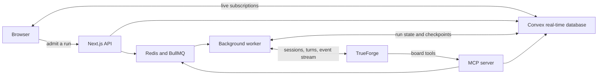

# The Squad

The Squad runs a fleet of specialist agents on TrueForge. Give the orchestrator a goal, and it turns that goal into tasks, assigns the right agent, tracks the work on a live board, and pauses before any external action that requires human approval.

The Squad is designed for work that is too large or risky for a single chat thread. Research can inform a written brief, which can then become a Linear issue. Each step has its own agent, context, tools, and completion record.

## Submission links

- Source code: [github.com/savarbhasin/hackathon](https://github.com/savarbhasin/hackathon)
- Live app: [hackathon-five-amber.vercel.app](https://hackathon-five-amber.vercel.app)
- Demo video: **Add the three-minute demo video link before submission**
- Blog post: **Add the blog post link here if entering the blog prize**

## What it does

- You describe an outcome in the orchestrator chat.
- The orchestrator creates a mission and a dependency graph of specialist tasks.
- Specialist agents research, write, file issues, or handle custom roles with their own models and tool access.
- The Kanban board updates as agents work, showing narration, tool calls, questions, failures, and completion states.
- Irreversible connector calls pause for approval. The worker resumes the same TrueForge thread after a person approves or denies an action, or answers a question.
- Completed tasks pass summaries and versioned Markdown documents to dependent tasks.
- Schedules can run the same agent workflow according to a cron schedule.

The board columns map to runtime state:

```text
backlog -> working -> blocked -> approval -> settled
```

A blocked task needs an answer. A task in the approval column has a pending action that a person must approve or deny. A settled task has completed its contract, and The Squad dispatches any successor once its dependencies are complete.

## Why TrueForge is the core

TrueForge runs every orchestrator and specialist turn. The Squad does not call a model provider directly. It creates TrueForge sessions, submits turns, consumes the event stream, and stores the TrueForge session and turn IDs so work can survive process restarts.

TrueForge also supplies the agent configuration and connector boundary. Each specialist gets its model, instructions, MCP tools, and connectors through TrueForge. Tool approval and response events are reflected in The Squad's board state. When someone approves an action or answers a question, the worker starts a new TrueForge turn with the matching tool response instead of flattening the interaction into a chat message.

This matters most during failure and recovery. Provider deltas can repeat after a reconnect, so the worker merges TrueForge event deltas, checkpoints the provider cursor in Convex, and writes terminal state only after the run owner passes its guards. The UI can reload without losing the agent's place or incorrectly showing a stale run as active.

## Architecture



Convex is the application source of truth. It stores missions, tasks, conversations, schedules, agent runs, provider checkpoints, pending approvals, and task activity. Browser subscriptions update the chat and board as soon as Convex changes.

Redis and BullMQ only deliver work. Next.js admits a run, Convex claims its ownership, and BullMQ wakes the background worker. The worker owns long-running TrueForge turns, merges streamed deltas, checkpoints progress, and projects each event into Convex. If the web process restarts, the run does not move into the browser or disappear with the request.

The MCP server gives TrueForge agents controlled access to The Squad. Its tools create missions and tasks, inspect the board, dispatch ready work, manage schedules, save documents, and record task completion through `mark_done`. Connector calls, such as filing a Linear issue, remain subject to the specialist's TrueForge tool policy.

## Main routes

| Route | Purpose |
| --- | --- |
| `/` | Orchestrator chat and live execution stream |
| `/board` | Mission kanban with approval and question handling |
| `/agents` | Specialist models, instructions, connectors, and tools |
| `/docs` | Versioned Markdown outputs and handoff documents |
| `/schedules` | Recurring prompts and run history |

## Local setup

### Prerequisites

Install these before starting The Squad:

- Node.js 22.14 or newer
- npm
- Docker with Docker Compose
- A Convex account and deployment
- TrueForge running locally
- At least one model provider configured in TrueForge

Exa and Linear are optional for the basic app, but the included researcher and filer flows use them. Add those connectors in TrueForge if you want to run the full research-to-Linear demo.

### 1. Install dependencies

```bash
git clone https://github.com/savarbhasin/hackathon.git
cd hackathon
npm ci
```

### 2. Configure Convex and environment variables

Copy the example file:

```bash
cp .env.example .env.local
```

Start Convex and select or create a deployment:

```bash
npx convex dev
```

Put your deployment values in `.env.local`. Do not commit this file.

| Variable | Example | Used by |
| --- | --- | --- |
| `NEXT_PUBLIC_CONVEX_URL` | `https://your-deployment.convex.cloud` | Browser |
| `CONVEX_URL` | `https://your-deployment.convex.cloud` | Next.js, MCP, worker |
| `CONVEX_SITE_URL` | `https://your-deployment.convex.site` | Convex HTTP actions |
| `REDIS_URL` | `redis://127.0.0.1:6390` | BullMQ producer, worker, MCP |
| `TRUEFORGE_BASE_URL` | `http://localhost:8790` | Next.js and worker |
| `WORKER_CONCURRENCY` | `2` | Worker |

Leave `npx convex dev` running during local development so schema and function changes reach the selected deployment.

### 3. Start Redis

```bash
docker compose up -d redis
```

The compose file binds Redis to port `6390` on localhost.

### 4. Start and configure TrueForge

Run TrueForge in another terminal:

```bash
npx @truefoundry/trueforge
```

Open [localhost:8790](http://localhost:8790) and configure a model provider. The Squad reads and reconciles TrueForge-managed agent profiles through the TrueForge SDK.

After the MCP process starts in the next step, register a TrueForge MCP connector named `mission-control` with this URL:

```text
http://localhost:3100/mcp
```

Add the Exa and Linear connectors in TrueForge if your selected specialists need them. The filer role requires approval for Linear's `save_issue` tool.

### 5. Start The Squad

Keep Convex, Redis, and TrueForge running. Open three more terminals from the repository root:

```bash
npm run dev:mcp
```

```bash
npm run dev:worker
```

```bash
npm run dev
```

Open [localhost:3000](http://localhost:3000). Send a mission from the home page, then watch its tasks move on [localhost:3000/board](http://localhost:3000/board).

## Useful checks

```bash
npm run lint
npx tsc --noEmit
npm run build
find src server worker convex -name '*.test.ts' -print0 | xargs -0 node --import tsx --test
```

## Qodo Code Review Evidence

Qodo reviewed the project throughout the hackathon, starting with the first merged build PR. These reviews cover the main architecture changes rather than a final cleanup pass.

| Merged pull request | Qodo review |
| --- | --- |
| [#3, Build the mission control console](https://github.com/savarbhasin/hackathon/pull/3) | [Initial control plane, task lifecycle, approval, and scheduling review](https://github.com/savarbhasin/hackathon/pull/3#pullrequestreview-5021703659) |
| [#10, Bring in Convex, workers, and queues](https://github.com/savarbhasin/hackathon/pull/10) | [Durable runtime and data ownership review](https://github.com/savarbhasin/hackathon/pull/10#pullrequestreview-5034331044) |
| [#12, Optimize durable streaming and recovery](https://github.com/savarbhasin/hackathon/pull/12) | [Replay, recovery, and concurrency review](https://github.com/savarbhasin/hackathon/pull/12#pullrequestreview-5052405009) |
| [#19, Preserve and group agent execution activity](https://github.com/savarbhasin/hackathon/pull/19) | [Streaming projection and task activity review](https://github.com/savarbhasin/hackathon/pull/19#pullrequestreview-5058029339) |
| [#22, Fix specialist completion ownership](https://github.com/savarbhasin/hackathon/pull/22) | [Run ownership and completion review](https://github.com/savarbhasin/hackathon/pull/22#pullrequestreview-5059032545) |

PR #19 is the representative completed review. Qodo found that replayed TrueForge events could duplicate durable assistant parts and that narration without a tool call could vanish from the task feed. I fixed both in [commit `27f9c409`](https://github.com/savarbhasin/hackathon/commit/27f9c40942caed04b1968afe531e129a3d020014) and added replay coverage. I dismissed one suggestion to settle every clean `turn.done` because The Squad requires specialists to call `mark_done`. A model stopping is not proof that its task contract is complete.

That pull request keeps the decisions and final review in one place:

- [Qodo's initial review](https://github.com/savarbhasin/hackathon/pull/19#pullrequestreview-5058029339)
- [Decision and fix for replayed assistant parts](https://github.com/savarbhasin/hackathon/pull/19#discussion_r3886551175)
- [Decision and fix for narration-only activity](https://github.com/savarbhasin/hackathon/pull/19#discussion_r3886551232)
- [Reason for dismissing the `turn.done` suggestion](https://github.com/savarbhasin/hackathon/pull/19#discussion_r3886551256)
- [Qodo's follow-up review against the final commit](https://github.com/savarbhasin/hackathon/pull/19#issuecomment-5462297871)

## Stack

Next.js 16, React 19, TypeScript, Convex, Redis, BullMQ, TrueForge SDK, Model Context Protocol
